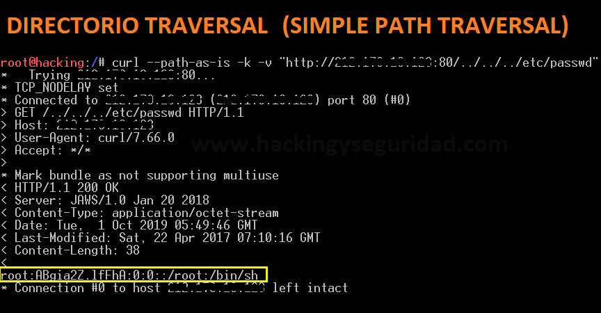

### Directory Traversal / Path Traversal Toolkit


Colección de scripts en **Bash**, **Python** y **NSE (Nmap)** para detectar y verificar vulnerabilidades de **Path Traversal / Directory Traversal** en servidores web, incluyendo pruebas específicas para varios CVE conocidos.

---

### 📑 Tabla de contenidos

- [¿Qué es Path Traversal?](#-qué-es-path-traversal)
- [¿Qué incluye este repositorio?](#-qué-incluye-este-repositorio)
- [Requisitos](#-requisitos)
- [Instalación](#-instalación)
- [Uso rápido](#-uso-rápido)
- [Scripts de explotación por CVE](#-scripts-de-explotación-por-cve)
- [Herramientas generales](#-herramientas-generales)
- [Diccionario de payloads](#-diccionario-de-payloads)
- [Ejemplo de ejecución](#-ejemplo-de-ejecución)
- [Códigos de respuesta HTTP relevantes](#-códigos-de-respuesta-http-relevantes)
- [Aviso legal / Uso responsable](#️-aviso-legal--uso-responsable)
- [Licencia](#-licencia)
- [Contribuciones](#-contribuciones)

---

###  Path Traversal

**Path Traversal** (también llamado *Directory Traversal*) es una vulnerabilidad web que permite a un atacante **salir del directorio raíz** de una aplicación y acceder a archivos y carpetas del sistema que no deberían ser accesibles públicamente.

Se explota manipulando parámetros de la URL o entradas de usuario que contienen rutas de archivo, insertando secuencias como `../` (o sus variantes codificadas: `%2e%2e%2f`, `..%c0%af`, etc.) para navegar por el sistema de ficheros del servidor.

Cuando la validación de entradas es insuficiente, un atacante puede llegar a leer archivos sensibles como:

| Sistema | Archivo objetivo típico | Información expuesta |
|---|---|---|
| Linux/Unix | `/etc/passwd` | Listado de usuarios del sistema |
| Linux/Unix | `/etc/shadow` | Hashes de contraseñas (requiere privilegios) |
| Windows | `windows/system32/cmd.exe` o `win.ini` | Ejecución/config. del sistema |
| Aplicaciones web | `web.config`, `.env`, `config.php` | Credenciales, claves de API |
| Servidores | Logs, certificados, código fuente | Información interna del backend |

**Ejemplo básico de payload:**

```bash
curl --path-as-is -k -v http://<ip>:80/../../../../../etc/passwd
```



**Ejemplo en Windows:**

```bash
curl --path-as-is -k -v http://<ip>:80/../../../../../../windows/system32/cmd.exe
```

> El flag `--path-as-is` evita que `curl` normalice la ruta (eliminando los `../`) antes de enviarla al servidor.

---

### ¿Qué incluye este repositorio?

| Categoría | Cantidad | Descripción |
|---|---|---|
| Exploits por CVE | 7 scripts `.sh` | PoC dirigidas a vulnerabilidades específicas y conocidas |
| Herramientas de escaneo genérico | 6 scripts | Fuzzing y prueba masiva de payloads de traversal |
| Script Python | 1 (`dir.py`) | Automatización de pruebas en Python |
| Script Nmap (NSE) | 1 (`traversal.nse`) | Detección de traversal vía Nmap Scripting Engine |
| Script PHP | 1 (`traversal.php`) | PoC / utilidad en PHP |
| Utilidades auxiliares | 3 scripts | Generación de certificados, gestión de URLs/SSL, actualización del diccionario |
| Diccionario de payloads | 1 (`pathtraversal.txt`, externo) | Wordlist de rutas y payloads de traversal |

---

### ⚙️ Requisitos

- Sistema Linux/Unix (probado en distribuciones tipo Debian/Ubuntu, Kali)
- `bash`
- `curl`
- `python3` (para `dir.py`)
- `nmap` (para `traversal.nse`)
- `git` (para clonar el repositorio y el diccionario asociado)
- Permisos y **autorización explícita** para probar el objetivo (ver [aviso legal](#️-aviso-legal--uso-responsable))

---

### Instalación

```bash
git clone https://github.com/hackingyseguridad/directoriotraversal.git
cd directoriotraversal
chmod +x *.sh
```

Para obtener/actualizar el diccionario de payloads:

```bash
./actualizar.sh
```

---

### Uso rápido

```bash
# Prueba genérica de Directory Traversal contra un objetivo
./directoriotraversal.sh <ip_o_dominio>

# Variante alternativa del escáner
./directoriotraversal2.sh <ip_o_dominio>

# Prueba específica sobre servidores Apache
./apache_path_traversal.sh <ip_o_dominio>

# Prueba de una CVE puntual (ejemplo: Apache Path Traversal 2021)
./CVE-2021-41773.sh <ip_o_dominio>
```

> Sustituye `<ip_o_dominio>` por el host objetivo que **tengas autorizado para auditar**.

---

### Scripts de explotación por CVE

| Script | CVE | Producto / Componente afectado | Descripción breve |
|---|---|---|---|
| `CVE-2001-0333.sh` | [CVE-2001-0333](https://nvd.nist.gov/vuln/detail/CVE-2001-0333) | IIS / servidores web antiguos | Traversal clásico mediante codificación de caracteres en la URL |
| `CVE-2009-1535.sh` | [CVE-2009-1535](https://nvd.nist.gov/vuln/detail/CVE-2009-1535) | Servidor FTP / Web | Acceso a archivos fuera del directorio raíz |
| `CVE-2018-0296.sh` | [CVE-2018-0296](https://nvd.nist.gov/vuln/detail/CVE-2018-0296) | Cisco ASA / FTD (WebVPN) | Traversal que permite denegación de servicio y divulgación de información |
| `CVE-2018-13379.sh` | [CVE-2018-13379](https://nvd.nist.gov/vuln/detail/CVE-2018-13379) | Fortinet FortiOS SSL VPN | Lectura de archivos de sesión (credenciales VPN en texto claro) |
| `CVE-2019-11510.sh` | [CVE-2019-11510](https://nvd.nist.gov/vuln/detail/CVE-2019-11510) | Pulse Secure VPN | Lectura arbitraria de archivos sin autenticación |
| `CVE-2021-41773.sh` | [CVE-2021-41773](https://nvd.nist.gov/vuln/detail/CVE-2021-41773) | Apache HTTP Server 2.4.49 | Traversal por normalización de rutas, puede derivar en RCE si `mod_cgi` está activo |
| `CVE-2021-42013.sh` | [CVE-2021-42013](https://nvd.nist.gov/vuln/detail/CVE-2021-42013) | Apache HTTP Server 2.4.50 | Bypass del parche de CVE-2021-41773 |

---

### Herramientas generales

| Script | Lenguaje | Función |
|---|---|---|
| `directoriotraversal.sh` | Bash | Escáner genérico de Path Traversal contra un objetivo |
| `directoriotraversal2.sh` | Bash | Versión alternativa/mejorada del escáner genérico |
| `dirhttp.sh` | Bash | Pruebas de traversal específicas sobre HTTP |
| `apache_path_traversal.sh` | Bash | Pruebas orientadas a servidores Apache |
| `dir.py` | Python | Automatización de pruebas de traversal en Python |
| `traversal.nse` | Lua (NSE) | Script para Nmap Scripting Engine, detección durante el escaneo de puertos |
| `traversal.php` | PHP | PoC / utilidad para pruebas desde entorno PHP |
| `probar.sh` | Bash | Lanzamiento de pruebas puntuales |
| `probarauto.sh` | Bash | Automatización de pruebas contra un objetivo |
| `probarauto2.sh` | Bash | Variante de la automatización anterior |
| `urlssl.sh` | Bash | Gestión/verificación de URLs sobre SSL |
| `generacert.sh` | Bash | Generación de certificados para pruebas sobre HTTPS |
| `actualizar.sh` | Bash | Descarga/actualiza el diccionario de payloads |

---

### 📖 Diccionario de payloads

El repositorio utiliza un diccionario externo de rutas y payloads de traversal, mantenido en:

🔗 [`diccionarios/pathtraversal.txt`](https://github.com/hackingyseguridad/diccionarios/blob/master/pathtraversal.txt)

Se descarga/actualiza automáticamente con:

```bash
./actualizar.sh
```

---

## 🧪 Ejemplo de ejecución

```bash
$ ./directoriotraversal.sh example.com

[+] Probando payloads de Directory Traversal contra example.com ...
[+] Cargando diccionario: pathtraversal.txt
[+] Payload: ../../../../etc/passwd        -> 403 Forbidden
[+] Payload: ..%2f..%2f..%2fetc%2fpasswd    -> 200 OK   [POSIBLE VULNERABLE]
[+] Reporte guardado en resultados.txt
```

> El resultado y formato exacto pueden variar según el script utilizado; revisa la salida de `-h` o `--help` de cada script si está disponible.

---

### Códigos de respuesta HTTP relevantes

| Código | Significado | Relevancia en Path Traversal |
|---|---|---|
| `200 OK` | Solicitud exitosa | El payload pudo haber tenido éxito; revisar el contenido devuelto |
| `301 / 302` | Redirección | El servidor puede estar normalizando la ruta antes de procesarla |
| `400 Bad Request` | Petición inválida | El servidor rechazó el formato de la ruta |
| `403 Forbidden` | Acceso denegado | Filtro o WAF bloqueando el intento |
| `404 Not Found` | Recurso no encontrado | La ruta no existe o el traversal no llegó al recurso esperado |
| `500 Internal Server Error` | Error del servidor | Puede indicar un comportamiento inesperado explotable |

Referencia completa: [RFC 2616 - Códigos de estado HTTP](https://www.w3.org/Protocols/rfc2616/rfc2616-sec10.html)

---

---


Para reportar bugs o sugerir nuevas CVE a incluir, abre un [Issue](https://github.com/hackingyseguridad/directoriotraversal/issues).

---

#
[www.hackingyseguridad.com](http://www.hackingyseguridad.com/)
[diccionarios/pathtraversal.txt](https://github.com/hackingyseguridad/diccionarios/blob/master/pathtraversal.txt)
#

